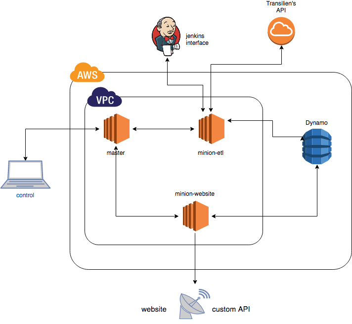

# Salt and Vagrant to deploy project


## Overview

This configuration is suited for a secure deployment with a regular Salt master-minions configuration (in comparison with other demo configurations that I have seen on github that were masterless).



This is the best design I found.

The Vagrant files launch three EC2 instances, (with an existing aws key):
- master instance: with salt-master installed
- website-minion instance:  with salt-minion installed
- etl-minion (extract-transform-load) instance:  with salt-minion installed

Master and minions communicate with others keys created specially for this purpose so that you don't expose your aws key, but still can access each of the instance directly (if the security groups you created allow ssh from other IPs than the master's one).

Vagrant lets you unidirectionally sync folders from your local computer with the master. You can enjoy an easy configuration, and a fixed IP for your master (required for salt-minions to work properly).

Then, you will ssh into the salt-master and launch states to configure environments for:
- a django application providing a website and an api
- an application that will regularly extract data from transilien's API, apply transformations, and save clean data in a Dynamo database.

## More about the project

This repository is part of a project with SNCF's R&D department.

These configuration will deploy thoses two applications:
- website/api: [source code here](https://github.com/leonardbinet/SNCF_project_website)
- ETL: [source code here](https://github.com/leonardbinet/Transilien-Api-ETL)

The project is detailed on the website, available at [this address] (http://www.sncf-departure-time-prediction.info/)

## Why Vagrant AND Salt?

Salt provides a cloud solution to launch EC2 instances and provision them, but requires to have a salt-master with a fixed IP. So it can not be your laptop. The best solution I found is to set up a master on EC2.

The problem was the ability to easily update salt files and configs.

That's where Vagrant provides better functionalities. An important one is the synced_folder. Every change you will make on you local computer will be easily synced on the EC2's salt-master.

## Setup: requirements and configuration customization

### Initial set-up
Git, VirtualBox and Vagrant must already be installed on your machine.

```
git clone https://github.com/leonardbinet/salt-vagrant-sncf-project.git
cd salt-vagrant-sncf-project
```
### Customization
Then, customize these files according to your needs.
- vagrant secrets
- vagrant settings
- salt secrets: secrets.sls pillar values
- salt settings: settings.sls pillar values

First, edit 'settings.sls' and 'secrets.sls' pillar files.

The only information you have to provide is: in 'settings.sls'

- **project_name** : no impact on application, just avoid spaces or special characters
- **git_rev**: your repo's branch name: for instance "master"
- **git_repo**: your repo's URL
- **DJANGO_SETTINGS_MODULE**: your application settings location, for instance: 'myapp.settings' (python import style: '.', not '/')
- **wsgi_app_loc**: for instance: 'myapp.wsgi'

Then if your application needs somes secrets to be included in your environment variables, just add them to the 'secrets.sls' pillar file.

### Set up your own rsa keys
These will be used to make your for salt master and minions to communicate:
```
cd saltstack
mkdir keys
cd keys

ssh-keygen -t rsa -f ./master_minion
ssh-keygen -t rsa -f ./minion_tel
ssh-keygen -t rsa -f ./minion_website
```

### Set up AWS ressources

#### Security groups
For master and etl-minion, you need to open ssh port.
For website-minion, you need to open also for web traffic.

#### Set up elastic_ip on AWS for your master
Set it in AWS, write it down in vagrantfile and in minions config files.

### Launch instances on EC2 with Vagrant

```
vagrant plugin install vagrant-vbguest
vagrant plugin install vagrant-aws
vagrant up
```

This will launch EC2 instances on AWS. They will be configured with ubuntu xenial64 images.

Remember that `pillar` and `salt` folder will be synced between your local machine and the remote master EC2 instance.

### Apply configuration to salt-minions with Salt

You can then run the following commands to log into the Salt Master and begin using Salt.
```
vagrant ssh master

# to test if your minions are responding
sudo salt '*' test.ping

# apply pillar changes
salt '*' saltutil.refresh_pillar

# apply states: it can take some time the first time (build python3.5 and pip requirements)
salt '*' state.apply
```

### Enjoy deploy
The website should be available on the minion_website. You will be able to see its IP on AWS console.

## How to use on your own Django projects

If you want to deploy your own django project, these salt states assume:
- that your application works with python3.5
- that your python requirements are written on a 'requirements.txt' file, in the root directory of your repo.
- have your django application read secrets from environment: in this case you need to add your secrets in the 'secrets.sls' pillar, they will be added on gunicorn conf and python virtualenv so they are available.


## TODO

### Logs
- currently django logs seems to be created by root user, and then cannot be edited by gunicorn's www-data user. (might be collectstatic or bower commands)

**Current workaround:**
- salt state to change permissions on django.logs file

**Ideal solution:**
- find which command creates automatically this root-owned django.logs

### Bower, and django collectstatic
- current difficulties: permissions, or shell prompt requiring answer

**Current workaround**
- cmd.run with "activate virtualenv" && "run django bower command"
- cmd.run with "activate virtualenv" && "run collectstatic command"

**Ideal solution**
- should work with builtin salt states
